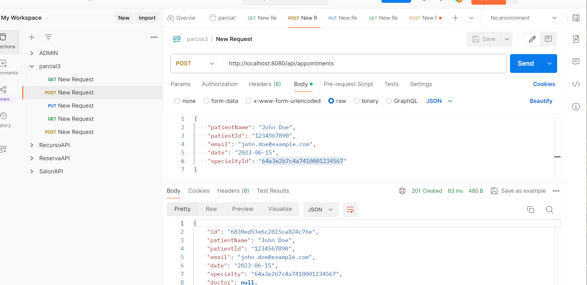

# 🏥 ECISalud - Medical Appointments Management System Backend

[](https://spring.io/projects/spring-boot)
[](https://www.mongodb.com/atlas/database)
[](https://www.oracle.com/java/)
[](https://azure.microsoft.com/)
[](https://opensource.org/licenses/Apache-2.0)
[](https://www.jacoco.org/jacoco/)
[](https://swagger.io/)

## 👨‍💻 Author
**Andersson David Sánchez Méndez** - Group 3

## 📋 Description
ECISalud is a robust web API for managing medical appointments at ECI Salud Vital clinic. This system allows patients to schedule appointments with specialists, manage their appointments, and provides administrative capabilities for healthcare providers. The system is deployed on Azure and connected to MongoDB Atlas for data persistence.

## 🏗️ Architecture

### Class Diagram


## 🚀 Features

- **Specialty Management:** Browse through different medical specialties available at the clinic
- **Appointment Scheduling:** Schedule appointments with specialists
- **Appointment History:** View all past and upcoming appointments
- **Appointment Cancellation:** Cancel appointments that are no longer needed
- **Data Validation:** Prevents scheduling appointments in the past
- **Automatic Specialty Information:** Automatically populates doctor and location information based on the selected specialty

## 💻 Technologies Used

- **Backend Framework:** Spring Boot 3.5.0
- **Database:** MongoDB Atlas (Cloud-hosted NoSQL database)
- **Language:** Java 17
- **API Documentation:** Swagger/OpenAPI
- **Testing:** JUnit 5, JaCoCo for code coverage
- **Deployment:** Microsoft Azure App Service
- **Version Control:** Git
- **Build Tool:** Maven
- **Containerization:** Docker (with Docker Compose support)

## 🔧 Technical Enhancements

### Backend Architecture

The backend follows a layered architecture pattern:

1. **Controller Layer:** Handles HTTP requests and responses
2. **Service Layer:** Contains business logic and data validation
3. **Repository Layer:** Interfaces with the MongoDB database
4. **Model Layer:** Represents data entities
5. **DTO Layer:** Data Transfer Objects for request/response transformations

### Data Initialization

The system includes a `DataInitializer` component that populates the database with the required specialties on application startup:

- Medicina General (General Medicine)
- Psicología (Psychology)
- Ortopedia (Orthopedics)
- Odontología (Dentistry)

Each specialty includes detailed information about the doctor, location, and a descriptive image.

### API Documentation

The API is fully documented using Swagger, providing an interactive interface to explore and test the endpoints.

### Testing Strategy

Comprehensive unit tests ensure the reliability of:

- Appointment creation with proper validation
- Appointment cancellation
- Specialty retrieval operations

## 🌐 API Endpoints

### Specialty Endpoints

- `GET /api/specialties`: Retrieve all specialties
- `GET /api/specialties/{id}`: Retrieve a specific specialty by ID

### Appointment Endpoints

- `GET /api/appointments`: Retrieve all appointments
- `GET /api/appointments/email/{email}`: Retrieve appointments for a specific email
- `GET /api/appointments/filter?email={email}&status={status}`: Filter appointments by email and status
- `POST /api/appointments`: Create a new appointment
- `PUT /api/appointments/{id}/cancel`: Cancel an appointment

## 📊 Testing Coverage

The backend includes comprehensive unit tests with a code coverage of 60%, focusing on critical components:
- Appointment Service
- Specialty Service
- Validation Logic

## 🔄 CI/CD Pipeline

The application is set up with a CI/CD pipeline that:
1. Builds the application
2. Runs unit tests
3. Measures code coverage
4. Deploys to Azure on successful builds

## 🖥️ Running Locally

1. **Prerequisites**
   - Java 17+
   - Maven
   - MongoDB (or use the cloud connection)

2. **Setup**
   ```bash
   git clone https://github.com/yourusername/ECISalud.git
   cd ECISalud
   ```

3. **Run**
   ```bash
   ./mvnw spring-boot:run
   ```

4. **Access**
   - API: http://localhost:8081/api
   - Swagger Documentation: http://localhost:8081/swagger-ui.html

## 🌟 Future Enhancements

- Implement user authentication and authorization
- Add doctor availability management
- Integrate with calendar systems
- Implement email notifications for appointments
- Add a patient profile management system

## 📄 License

This project is licensed under the Apache License 2.0 - see the LICENSE file for details.

## 🖼️ Screenshots

### API Documentation (Swagger)


### Database Schema


### API Endpoints

