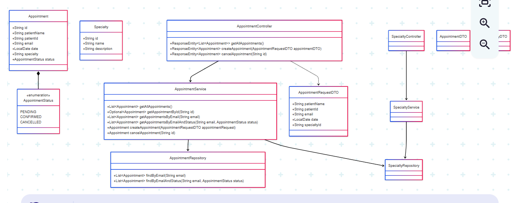
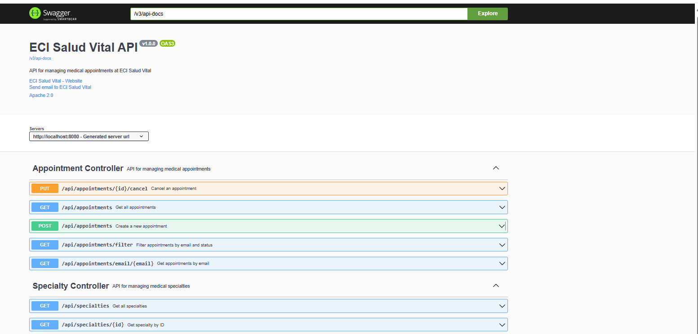
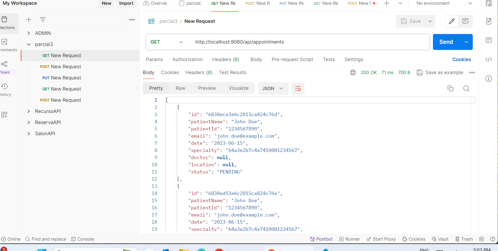

# 🏥 ECISalud - Medical Appointments Management System

<div align="center">
  
  
  
  _Author: **Andersson David Sánchez Méndez** - Group 3_
  
  [](https://spring.io/projects/spring-boot)
  [](https://www.mongodb.com/atlas/database)
  [](https://www.oracle.com/java/)
  [](https://azure.microsoft.com/)
  [](https://opensource.org/licenses/Apache-2.0)
  [](https://www.jacoco.org/jacoco/)
  [](https://swagger.io/)
  
</div>

## 📋 Description
ECISalud is a robust web API for managing medical appointments at ECI Salud Vital clinic. This system allows patients to schedule appointments with specialists, manage their appointments, and provides administrative capabilities for healthcare providers. The system is deployed on Azure and connected to MongoDB Atlas for data persistence.

## 🏗️ Architecture

### Class Diagram


### Component Diagram


## 🔧 Technologies Used

### Backend
- **Spring Boot 3.5.0**: Framework for creating stand-alone, production-grade Spring-based applications
- **Spring Data MongoDB**: Easy integration with MongoDB databases
- **Spring Validation**: For data validation
- **SpringDoc OpenAPI**: For API documentation with Swagger UI
- **Lombok**: To reduce boilerplate code (manually implemented getters/setters due to compatibility issues)
- **Maven**: Dependency management and build tool
- **JUnit 5**: For unit testing with extensive coverage
- **MongoDB Atlas**: Cloud NoSQL database for data storage
- **Java 17**: Programming language
- **Azure App Service**: For cloud deployment
- **JaCoCo**: For test coverage reporting
- **Cross-Origin Resource Sharing (CORS)**: Enabled for all origins to facilitate frontend integration

## 📊 API Documentation

### Swagger UI
The API documentation is available via Swagger UI at:
```
https://god-fwcafqgvhvbdfthh.canadacentral-01.azurewebsites.net/swagger-ui/index.html
```

For local testing:
```
http://localhost:8081/swagger-ui/index.html
```

## ⚙️ Backend Implementation

### Controllers
- **AppointmentController**: REST endpoints for managing appointments
  - `GET /api/appointments`: List all appointments
  - `GET /api/appointments/email/{email}`: Get appointments by email
  - `GET /api/appointments/filter?email={email}&status={status}`: Filter appointments by email and status
  - `POST /api/appointments`: Create a new appointment
  - `PUT /api/appointments/{id}/cancel`: Cancel an appointment

- **SpecialtyController**: REST endpoints for managing medical specialties
  - `GET /api/specialties`: Get all specialties
  - `GET /api/specialties/{id}`: Get specialty by ID

### Services
- **AppointmentService**: Business logic for appointment management
  - Get all appointments
  - Get appointments by email
  - Get appointments by email and status
  - Create appointment with date validation
  - Cancel appointment

- **SpecialtyService**: Business logic for medical specialty management
  - Get all specialties
  - Get specialty by ID

### Models
- **Appointment**: Represents a medical appointment with patient details, date, specialty, and status
- **Specialty**: Represents a medical specialty with name, description, doctor, location, and image URL

### Data Transfer Objects (DTOs)
- **AppointmentRequestDTO**: For creating new appointments with validation
- **AppointmentDTO**: For transferring appointment data
- **SpecialtyDTO**: For transferring specialty data

### Validation
Input validation is implemented using Jakarta Validation annotations:
- `@NotBlank`: For required string fields
- `@Email`: For validating email format
- `@NotNull`: For required non-string fields
- Custom validation in service layer for appointment dates (rejects past dates)

### Repositories
MongoDB repositories for data access:
- **AppointmentRepository**: For appointment data access
- **SpecialtyRepository**: For specialty data access

### Data Initialization
- **DataInitializer**: Automatically populates the database with the required specialties on application startup:
  - Medicina General
  - Psicología
  - Ortopedia
  - Odontología

## 🚀 Setup and Running Instructions

### Prerequisites
- Java 17 or higher
- Maven 3.6.3 or higher
- MongoDB instance (local or cloud-based)

### Configuration


### Running Locally
1. Clone the repository
2. Configure MongoDB connection in `application.properties`
3. Run with Maven:
   ```bash
   mvn spring-boot:run
   ```
   
### Testing
Run the tests with:
```bash
mvn test
```

Coverage reports will be generated in the `target/site/jacoco` directory.

## 🔄 CI/CD

The application is set up with a CI/CD pipeline that:
- Builds the application
- Runs unit tests
- Verifies code coverage (minimum 60%)
- Deploys to Azure App Service

## 🌐 Deployment

The backend is deployed on Azure App Service and is accessible at:
```
https://god-fwcafqgvhvbdfthh.canadacentral-01.azurewebsites.net/
```

## 📸 POSTMAN TESTING




## 📑 Swagger Docs


